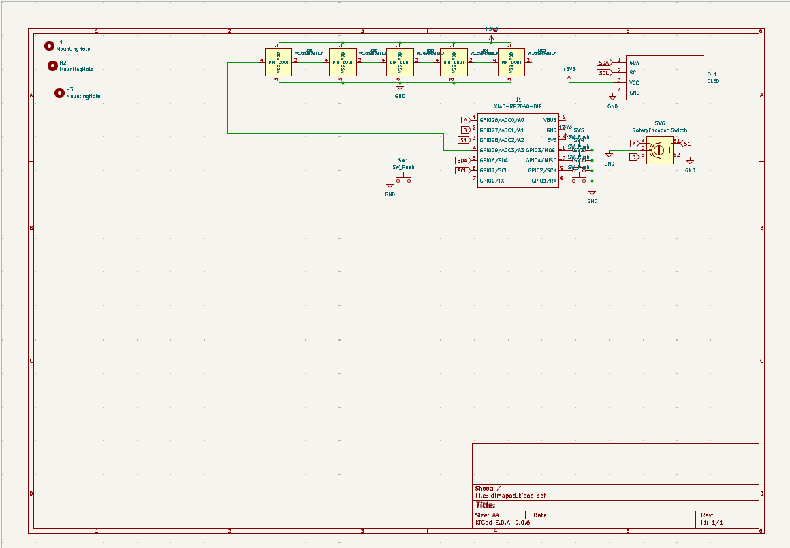

# Dimapad

## Description

Dimapad is An elegant 3x2 macropad with rotary encoder and OLED display

## Pinout

| Device |    |
|--------|------|
| **Matrix rows** | GPIO28, GPIO0, GPIO3 |
| **Matrix cols** | GPIO4, GPIO2, GPIO1 |
| **Encoder** | GPIO26, GPIO27 |
| **OLED** (I2C) | SDA: GPIO6, SCL: GPIO7 |
| **RGB LED** | GPIO29 |

